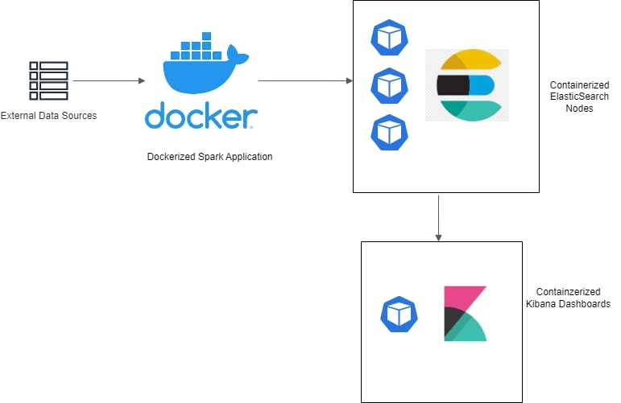

# Local Crime News Aggregator

The local crime news aggregator is a dashboard system consisting of a Scala backend system and near real-time configurable Kibana Dashboard. Crime incident data is fetched from two different types of sources.
- [US Open Data sources](https://data.gov/) for historical data
- A propeitery data source for more real-time data

The data is retrieved, processed, and normalized through a Spark + Scala backend system. It is then pushed to Elastic Search nodes deployed on Kubernetes pods. The Kibana dashboards deployed as Kubernetes deployment fetches data from Elasticsearch Index to render the heatmap

## System Architecture



## Tech Stack
- Data Processing Backend: Scala, Apache Spark
- Dashboards: Kibana (ELK Stack), Beats (system heartbeats)
- Databases: Elasticsearch (ELK Stack)
- Infrastructure: 
  - Backend is containerized as a Docker image
  - Elasticsearch is deployed as K8s stateful set with 3 replicas. This ensures 3 instances of elasticsearch with data sharded between them
  - Kibana is deployed as K8s deployment with PodDisruptionBudget. This ensures 99% uptime and responsive endpoints
  - AWS services have been used extensively in the K8s configurations from EC2, ELB, EBS, S3, etc
  

## Directory Structure
```
.
├── Dockerfile - Builds a docker image of the Scala code compiled and built
├── README.md
├── build.sbt 
├── dashboard - Kibana dashboard configuration
├── docker-elk-stack - ELK stack deployment configurations using Docker Compose
├── k8s-stack - ELK stack deployment configurations using Kubernetes and AWS 
├── project
├── src
├── static_media - Repo related static media files
├── target
└── utilities - extra utilities created over the course of the project 
```

## Acceptance Criteria
- Dashboard queries and filters response time must be less than 5 sec. 
  - We were able to achieve 200ms to 250ms response time for most queries. Very complex queries and cache misses made up the 99% percentile queries at around 1s response time.
- Dashboard's service availability must be greater than 99%. 
  - The kibana dashboards are deployed as a K8s (Kubernetes) deployment with as a `PodDisruptionBudget`. This property on Kubernetes pods ensures that all the specified pods will have an 100% uptime, given the system resources are available. 

## Steps to Execute
### Data Processing Backend
 - The `sbt-native-packager` plugin enables generating docker images post building the Scala project through SBT
 - `sbt docker:publishLocal` command generates a docker image locally. (Pre-req requires Docker installed)

### Local ELK Stack Deployment
- The database and dashboards can be deployed locally for testing purposes. This strategy doesn't ensure service uptime of any level.
- The `docker-elk-stack` contains all the configurations required to deploy the ELK stack v8.7.0 through Docker Compose.
- Change dir into the folder `cd docker-elk-stack`
- Use the command `docker compose up -d` to start elasticsearch, kibana and complete the initial setup required.
- Use `docker compose ls` and `docker ps` to verify the running containers
- Elasticsearch and Kibana support communication over REST HTTP API calls. Elasticsearch runs on port 9200 and Kibana on 5601

### Deploying ELK Stack on AWS
- While deploying ELK Stack on AWS through Kubernetes, the following tools are required: kops, kubectl, awscli
- Create an IAM user with required IAM policies configured. Configure the local terminal environment with the AWS_ACCESS_KEY_ID, AWS_SECRET_ACCESS_KEY values 
- Create the Kubernetes cluster using (update values as required) 
```bash
kops create cluster k8s-cluster.example.com \
  --node-count 3 \
  --zones $ZONES \
  --node-size $NODE_SIZE \
  --control-plane-size $CONTROL_PLANE_SIZE \
  --control-plane-zones $ZONES \
  --networking cilium \
  --topology private \
  --bastion="true" \
  --yes
  ```
- Post cluster creation, validate the cluster infra using `kops validate cluster`
- Apply node configurations from each of the folders, in the order of the naming convention using `kubectl apply -f <dir_name>`
- Delete the K8s cluster using `kops delete cluster k8s-cluster.example.com`

## Notes
- Elasticsearch, Kibana and the other extensions are generally referred to commonly as ELK Stack
- Kubernetes is usually abbreviated to K8s.